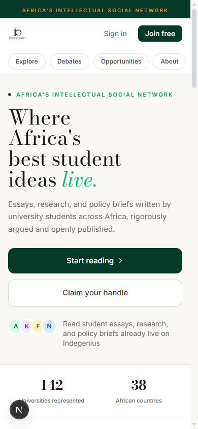
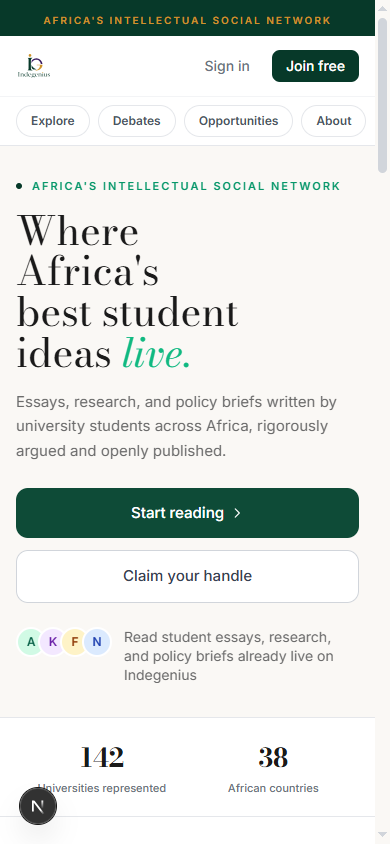
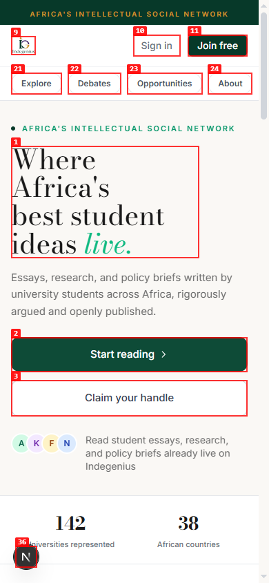

# UI/UX Audit: Indegenius

| Field | Value |
|-------|-------|
| **Date** | 2026-07-22 |
| **App URL** | http://localhost:3004 |
| **Session** | indegenius-uiux-audit |
| **Scope** | Mobile-first product-wide audit, with desktop parity |

## Summary

| Severity | Count |
|----------|-------|
| Critical | 0 |
| High | 1 |
| Medium | 0 |
| Low | 0 |
| **Total** | **1** |

## Issues

### ISSUE-001: Guest reading CTAs loop back to the landing page

| Field | Value |
|-------|-------|
| **Severity** | high |
| **Category** | functional / ux |
| **URL** | http://localhost:3004/landing |
| **Repro Video** | N/A — local browser recorder could not encode without ffmpeg |

**Description**

The primary “Start reading” CTA and the later “Browse as guest” CTA navigate to `/?guest=1`, but the unauthenticated routing resolves that URL back to `/landing?guest=1`. The user remains on the same landing page instead of reaching the public feed. This blocks the product’s main guest-conversion journey on mobile and desktop.

**Repro Steps**

1. Open the landing page as a signed-out user.
   

2. Activate “Start reading.”
   

3. **Observe:** the URL is `/landing?guest=1` and the same landing page remains visible.
   

---
